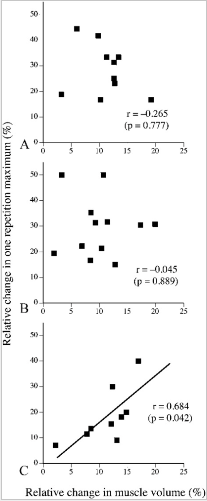

## Correlation Part II

In the previous blog series (see parts I-III) we showed how correlations fail. Now you may wonder, what gives...

Mediation is an inherently causal model, where the causal antecedent (X) causes the mediator (M), which then causes the outcome variable (Y). An indirect effect is meant to quantify the causal effect that X has on Y through M. While random assignment to condition is sufficient for causal inference in examining the effect of X on Y, random assignment on X is not sufficient to know that all of the effects in a mediation analysis are themselves causal. Importantly, because the mediator is not randomly assigned, it is unknown whether the estimate of its effect on the outcome is an estimate of a causal effect.

## Training effects...

Obviously the correlation can change depending on the training protocol:

<https://journals.lww.com/nsca-jscr/fulltext/2021/04000/effects_of_4,_8,_and_12_repetition_maximum.1.aspx>
